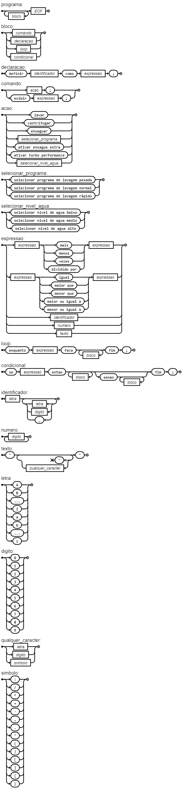

# WashLang
WashLang is a specialized programming language designed to automate and control washing machines. This language allows users to specify washing routines including various washing modes such as heavy, normal, and quick cycles, along with options for extra rinse and turbo performance.

<p align="center">
  
</p>

The presentation can be found [here](Presentation/WashLang.pdf).

* #### [EBNF](#EBNF)
* #### [Flex & Bison](#Flex-&-Bison)

#### <a name="EBNF">EBNF</a> 

```ebnf
programa = { bloco }, EOF;

bloco = comando | declaracao | loop | condicional;

declaracao = 'definir', identificador, 'como', expressao, ';';

comando = acao, ';'
        | 'exibir', expressao, ';';

acao = 'lavar'
     | 'centrifugar'
     | 'enxaguar'
     | selecionar_programa
     | 'ativar enxague extra'
     | 'ativar turbo performance'
     | selecionar_nivel_agua;

selecionar_programa = 'selecionar programa de lavagem pesada'
                     | 'selecionar programa de lavagem normal'
                     | 'selecionar programa de lavagem rápido';

selecionar_nivel_agua = 'selecionar nivel de agua baixo'
                      | 'selecionar nivel de agua medio'
                      | 'selecionar nivel de agua alto';

expressao = expressao, ('mais' | 'menos' | 'vezes' | 'dividido por'), expressao
          | expressao, ('igual' | 'maior que' | 'menor que' | 'maior ou igual a' | 'menor ou igual a'), expressao
          | identificador
          | numero
          | texto;

loop = 'enquanto', expressao, 'faca', { bloco }, 'fim', ';';

condicional = 'se', expressao, 'entao', { bloco }, [ 'senao', { bloco } ], 'fim', ';';

identificador = letra, { letra | digito | '_' };

numero = digito, { digito };

texto = '"', { qualquer_caracter - '"' }, '"';

letra = 'A' | 'B' | '...' | 'Z' | 'a' | 'b' | '...' | 'z';

digito = '0' | '1' | '2' | '3' | '4' | '5' | '6' | '7' | '8' | '9';

qualquer_caracter = letra | digito | simbolo;

simbolo = ':' | '/' | '*' | '+' | '-' | ',' | '.' | '"' | '(' | ')' | '[' | ']' | '{' | '}';

```


WashLang is tailored to manage washing machine operations efficiently. Here is an example of how to define and execute a washing routine:
```bash
-- Setting the water level and selecting the wash mode are prerequisites for starting the wash
selecionar nivel de agua alto;
selecionar programa de lavagem normal;
ativar enxague extra;
ativar turbo performance;

-- The washing machine follows these commands in a predefined sequence based on the selected program
lavar;
enxaguar;
centrifugar;

-- Example to check the current mode and perform an action based on the condition
se nivel_agua igual a "alto" entao
    exibir "Nível de água está alto.";
senao
    exibir "Nível de água não está alto.";
fim;
```
#### <a name="Flex-&-Bison">Flex & Bison</a> 

To test the Flex & Bison you can do:
```sh
flex washlang.l
bison -d washlang.y
```

```sh
gcc lex.yy.c washlang.tab.c -o washlang -lfl
```

```sh
./washlang test_input.txt
```
